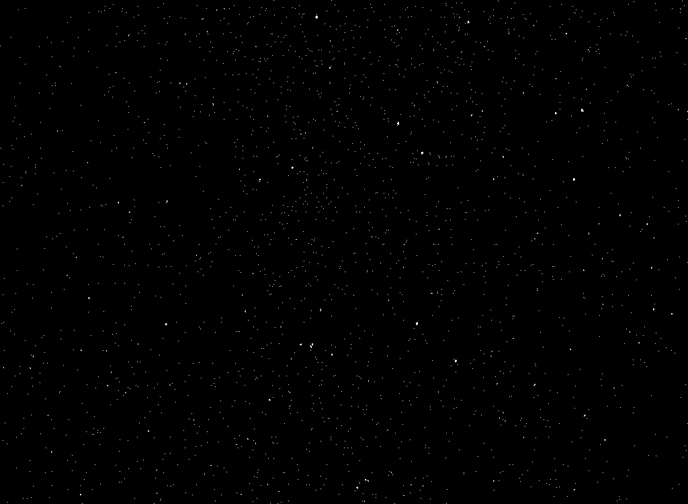
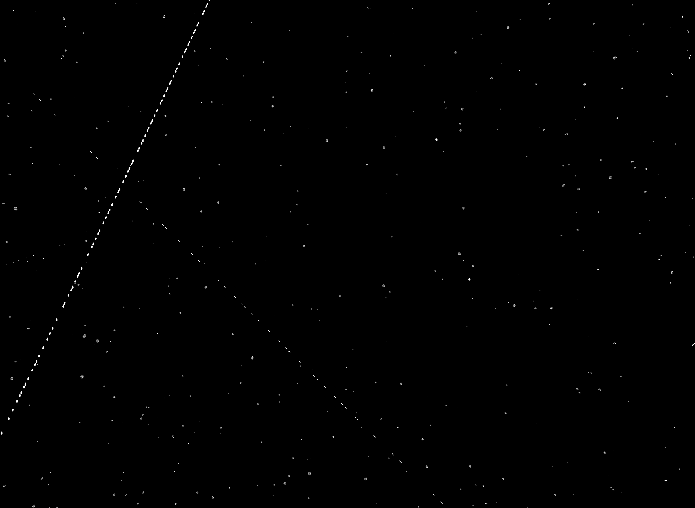

# Image Processing Pipeline Tool Box

## Sample Data

## Sample Output

Copyright © 2026 Joaquin Philco. All rights reserved.

This repository and all of its contents, including but not limited to source code, documentation, and associated files, are the exclusive property of the author.

**No permission is granted to any person or entity to use, copy, modify, merge, publish, distribute, sublicense, or sell copies of this software or any part thereof, in any form or by any means, without the explicit prior written permission of the author.**

## License

This project is NOT open source. All rights reserved.

Unauthorized use, reproduction, or distribution of this software, in whole or in part, is strictly prohibited and may result in legal action.

For licensing inquiries, please contact the repository owner directly through GitHub.
